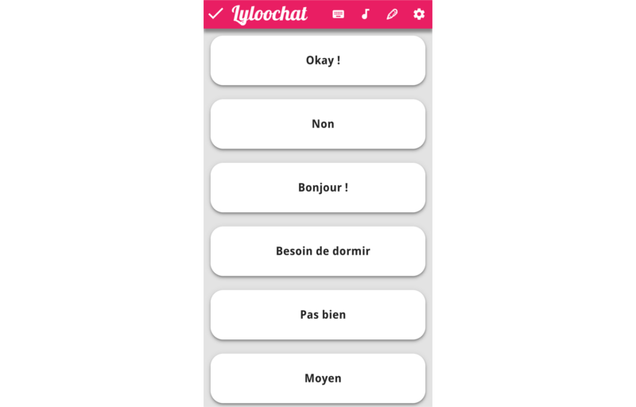

# LylooChat (Archived)
Help software for Leylyloo.

### Installation

cd wwww && npx bower install

### Technologies utilisées

  * Phonegap - to support various platforms and access devices - http://phonegap.com/
  * gulpjs - to manage workflow - http://gulpjs.com/
  * PureCss - for the responsive grid - http://purecss.io/
  * Flexbox - for the global layout
  * handlebars - to do some templating on client side - http://handlebarsjs.com/
  * jQuery - for manipulating dom
  
### Resultat

